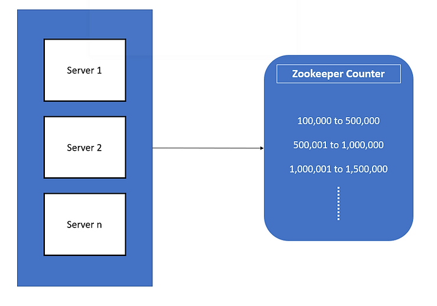
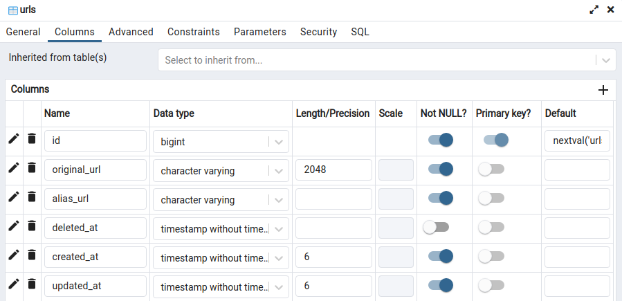
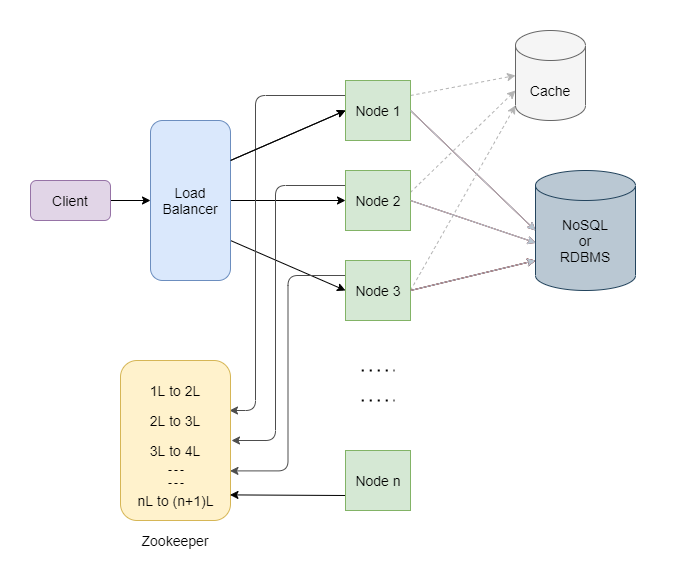
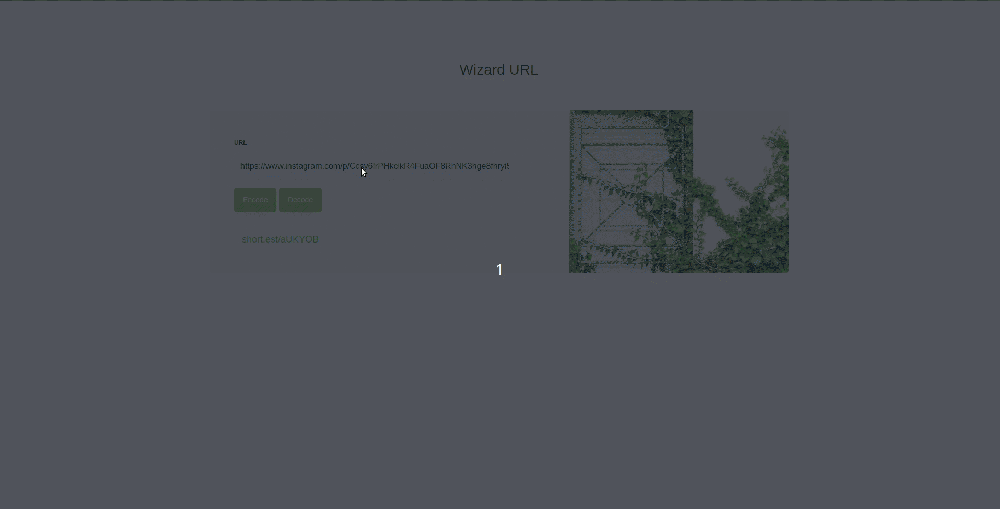

# README

## Let's dive into the problem
The goal is to design a highly scalable service that could allow users to create shorter URLs. This service also allows a shortened URL to be decoded back to its long URL correctly.

## System's requirements
1. For a given input URL (long URL) our service should generate and return a shortened URL to the user.
2. When the user clicks on the shortened URL, our service should redirect the user to the original URL.
3. The system should be scalable, highly available.
4. Our system should be performant.
5. For security purposes, the generated short URL should be as random as possible, it should not be predictable.

## Data estimates
Our system is designed to receive a large amount of traffic with a read-to-write ratio is 100:1 for instance. We also assume we will have 50 million new URL-shortening requests per month. With the above read/write ratio, we can expect 100 * 50 million = 5 billion redirections during the same period.
* For each second, total number of queries per second = 50 million / (30 days * 24 hours * 3600 seconds) = ~19 URLs/s
* The URL's length limit for our system is a maximum of 2048 characters (2048 bytes) and then we add 52 more bytes to store the information about the URL. Total storage requirement for our system in the next 10 years = 2100 bytes * (10 * 12) * 50 million = 12.6 TB

## Encoding URL
We will use [A-Za-z0-9] to encode our URLs which leads us to use base62 encoding. The point of this system is to keep our URL as short as possible. If we keep our encoded URL to have a length of 6, with the rate of 19 URLs/s, it would take about 95 years to run out.

MD5 algorithm takes a string as input and produces a fixed length output and it is mostly unique, there is still a chance of it producing the same output for two different inputs. The thing with MD5 is it produces a really long output. This is a problem because we have a restriction of at least 6 characters for our random string. The problem can be solved by taking only the first 7 characters of the MD5 output, but this increases the chances of collision. This means for different long URLs we might end up with the same 6 characters as output and this break out the system.

Base62 algorithm acts differently a bit. Base62 also produces an output consisting of a combination of the same 62 letters as MD5. But it takes an integer type as input. So we need to first convert the long URL to a unique number and then pass this number to the base62 algorithm. Each time we generate random characters using base62, we first need to check if the data is already present in the database. We repeat this until we obtain a unique string. Now, this is clearly not an efficient approach. Imagine having two replicas of the server running, and a request comes into each of these servers simultaneously, this can lead to data corruption when each of these servers tries to save the data into the database.

This can be solved by using a counter-based approach. The idea is to make use of a counter. When the server gets a request to convert a long URL to a short URL, it first talks to the counter to get a count value, this value is then passed to the base62 algorithm to generate a random string. Making use of a counter to get the integer value ensures that the number we get will always be unique by default because after every request the counter increments its value by 1. As you can seen this is a much efficient compared to our previous approaches where we had to check if the random string obtained is unique or duplicate each time before we could write it to our database.

Even with the counter-based approach, we have to take care of a few things. For instance, the here counter is a single point of failure, if the counter goes down our entire service stops working. What if the counter runs out of numbers? Also if our service has multiple server instances running to manage the load and if two or more servers request the counter for a number at the same time, will the counter be able to handle this by properly incrementing and sending them unique numbers? Here comes the savior - Apache Zookeeper. Zookeeper is an open-source distributed service that can be used for maintaining configurations, managing coordination between services in a cluster, distributed synchronization, naming nodes in a cluster, and many other things. In addition to the above functionalities zookeeper also provides a shared counter. The counter provided by the zookeeper contains a range of values within it. For each new server created in our service, the zookeeper assigns one of these ranges. If a server runs out of the counter range assigned to it, the zookeeper assigns it a new range. Zookeeper is a distributed service, if the counter node fails, the zookeeper automatically spins up a new counter instance. Also as we get more users using our service, we can add as many servers as we want to handle this load, zookeeper takes care of assigning and maintaining the counter values for all these servers.



* We will run multiple instances, if a new server is added, it will give them an unused range. If the range runs out, the existing server can go to Zookeeper and ask for a new, unused range.
* If one of the servers dies, a range of numbers will be wasted, which is acceptable, given the 62^6 (about 56 billion) keys we have
* However, sequentially generating URLs can be a security threat because it's easy to guess what is the next encoded URL. We can randomly take out a number from a given range to increase the randomness.

## Database design
For our system, relational queries will not be a large part of it/occur rarely. So, the best option is NoSQL because it would be easier to scale. However, in this implementation, I will use Postgresql because of my lack of experience with NoSQL.



## Scaling the service
### Caching
We know that our database is going to be read heavily. We can speed it up by putting as much data in memory as possible. This becomes important if we get massive load requests to a single link. Our caching strategy is storing 20% of the most used URLs, when the cache is full, we would want to replace a URL with a more popular one.

### Load balancing
With multiple access systems like this one, a web server may not enough to handle a large number of requests. To solve this problem, we can use multiple servers with multiple load balancers between Client-Server and Server-Database to avoid a single point of failure.



## Implementation
### Requirements
* Ruby 3.1.2
* Rails 6.1.7
* Postgresql 14.2

### API docs
#### Encoding URL: POST /api/v1/urls/encode
1. Request
* Headers: None
* Body:
  * url <string> (required): your long URL (max 2048 characters), e.g: ?url=https://stackoverflow.com/questions/3842818/how-to-change-rails-3-server-default-port-in-develoment
  * locale <string> (optional): your preference language between English-en and Vietnamese-vi, e.g: ?locale=vi

2. Response
* Headers: None
* Body:
  * When your params is invalid:
  ```
  {
    success: false,
    errors: [
      {
        resource: "url",
        field: "original_url",
        code: 1009,
        message: "Original URL is not a valid URL"
      }
    ]
  }
  ```
  * When your params is valid:
  ```
  {
    success: true,
    data: {
      id: 1,
      original_url: "https://stackoverflow.com/questions/3842818/how-to-change-rails-3-server-default-port-in-develoment",
      alias_url: "short.est/aBDCuY"
    }
  }
  ```

#### Decoding URL: GET /api/v1/urls/decode
1. Request
* Headers: None
* Body:
  * url <string> (required): shortened URL, e.g: ?url=short.est/aBDCuY
2. Response
* Headers: None
* Body:
  * When your shortened URL NOT EXISTS in the database
  ```
  {
    success: false,
    errors: [
      {
        resource: "url",
        code: 1100,
        message: "Couldn't find url"
      }
    ]
  }
  ```
  * When your shortened URL EXISTS in the database
  ```
  {
    success: true,
    data: {
      original_url: "https://stackoverflow.com/questions/3842818/how-to-change-rails-3-server-default-port-in-develoment",
      alias_url: "short.est/aBDCuY"
    }
  }
  ```

### Configuration
#### Database creation
First we need to create a config file for our database connection.
```
cp config/database.example.yml > config/database.yml
cp config/application.example.yml > config/application.yml
```
Then fill your database username and password in the newly created file `config/application.yml`

#### Install all dependent gems
```
bundle install
```

#### Boot our app up
We can start using our app by running the following command
```
rails s
```


